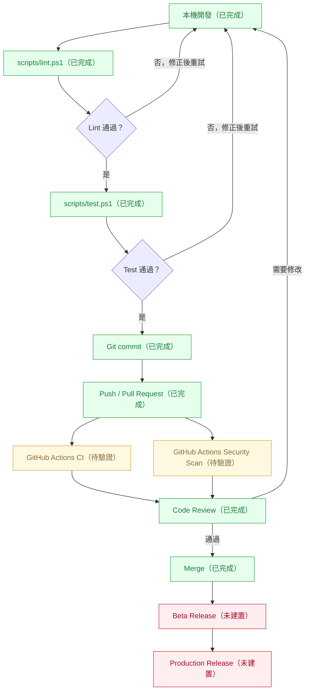
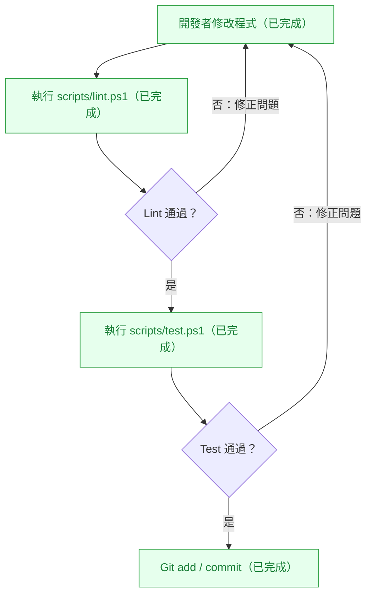
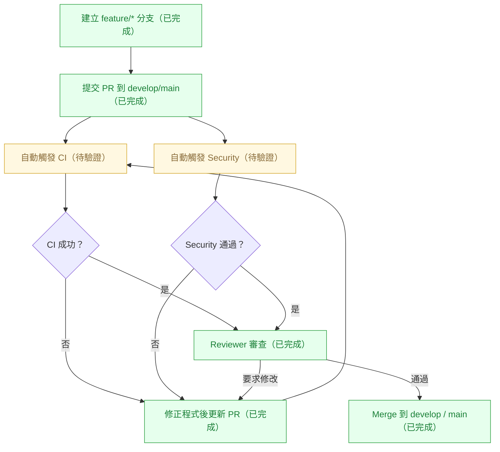
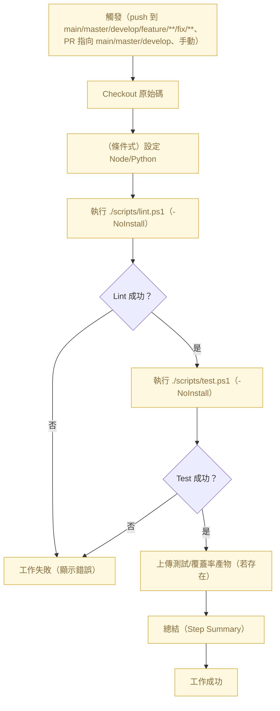
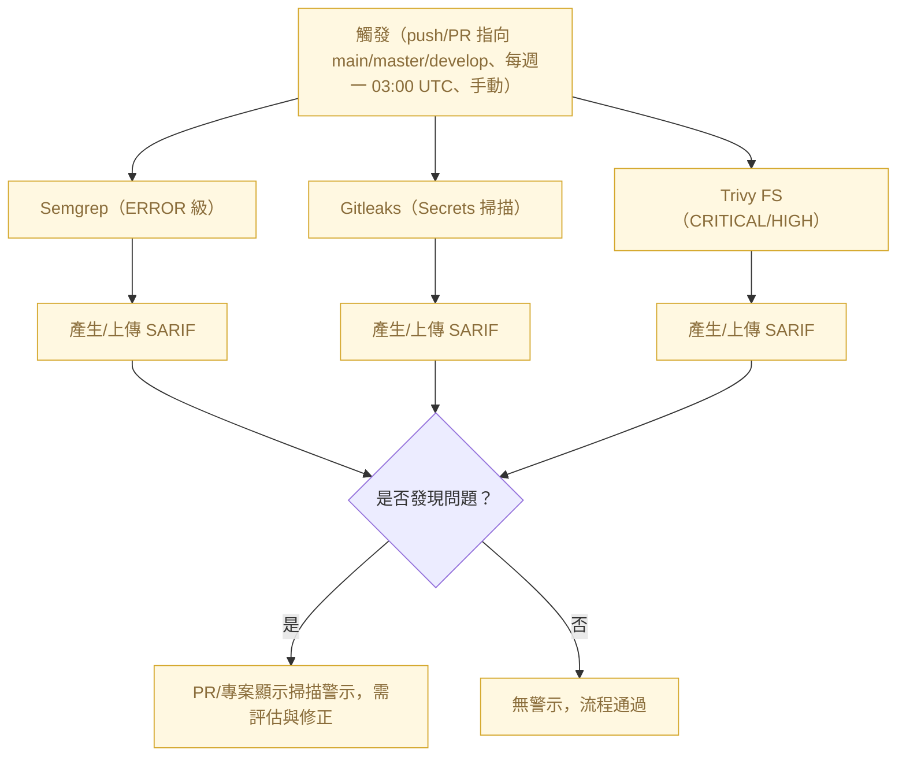
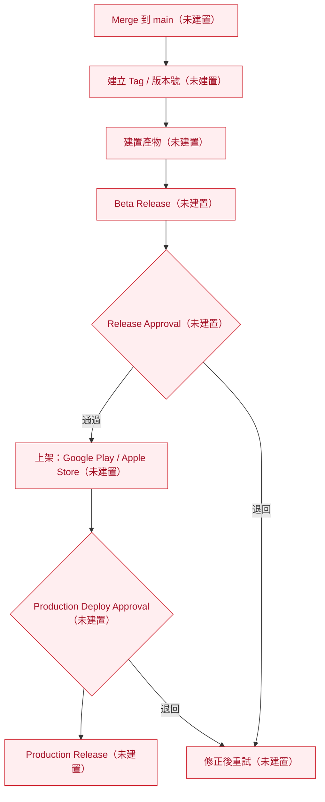

# 全流程總覽（Full Process Flow）

- 目前階段：Phase 1（工程骨架建立完成）＋ Phase 2（基礎 CI / Security 已建立，待驗證）
- 已完成重點：本機腳本（lint/test）、PR 模板與審查清單、工程流程文件、CI 與 Security 工作流骨架、Dependabot 設定。
- 尚未完成重點：Beta/Production 發布流程（CD）未建置；CI/Security 尚未在本專案代碼上完整驗證；未設定正式的合併 Gate（僅文件層級建議）。
- 下一步最建議先做的事：實際 push / PR 驗證 `ci.yml`、`security.yml`；設定分支保護與必要檢查；逐步規劃 Beta/Production 發布流程與核准 Gate。

> 註：本文件內容依目前 repo 中已存在檔案與工作流推定（2026-03-28）。

---

# 1. 文件目的
這份文件用白話與圖解方式，說明目前專案的整體工程流程，包含本機開發、CI、Security、Code Review、文件與腳本的關係，以及未來的發布（Beta/Production）規劃。適合新加入的開發者、審閱者與維運人員快速掌握「流程如何跑、哪些已完成、哪些待驗證、哪些尚未建置」。

# 2. 目前專案所處階段
- Phase 1：工程骨架建立完成（已完成）
  - 已有：`AGENTS.md`、`code_review.md`、`docs/engineering-workflow.md`、`docs/file-guide.md`、`docs/quick-start.md`、`scripts/lint.ps1`、`scripts/test.ps1`、PR 模板、Dependabot 設定。
- Phase 2：基礎 CI / Security 已建立（待驗證）
  - 已有：`.github/workflows/ci.yml`、`.github/workflows/security.yml`（尚未在實際程式碼上驗證結果）。
- Phase 3：Beta / Release 尚未建立（未建置）
  - 尚未提供 Beta/Production CD 工作流與核准 Gate。

# 3. 整體工程流程總覽圖
下圖統整本機→PR→CI/Security→審查→合併→（規劃中）發布的全貌。節點狀態以顏色與文字標註：綠色=已完成、黃色=待驗證、紅色=未建置。

# 4. 各子流程圖

## 4.1 本機開發與提交前檢查流程圖（已完成）
此流程描述開發者在本機修改程式後，如何以共用腳本進行基本檢查，確保提交品質。

## 4.2 Pull Request 與審查流程圖（骨架已完成，待驗證）
依 `docs/engineering-workflow.md` 與 `ci.yml/security.yml` 設定，PR 指向 `main/master/develop` 會觸發 CI 與 Security；審閱通過後合併。

## 4.3 CI 執行流程圖（依 ci.yml 推定，待驗證）
CI 在 Ubuntu runner 上執行 PowerShell，條件設定 Node/Python（依目前檔案推定），以 -NoInstall 呼叫共用的 lint/test 腳本並上傳產物。

## 4.4 Security 檢查流程圖（依 security.yml 推定，待驗證）
Security 工作流執行 Semgrep（僅 ERROR、排除 docs/.github/*.md）、Gitleaks（Secrets）、Trivy FS（僅 CRITICAL/HIGH），並上傳 SARIF（聚焦高價值掃描）。結果會顯示於 PR 的 Code Scanning。

## 4.5 未來發布流程圖（規劃中，未建置）
下圖僅為規劃態，實際 CD/發布與核准 Gate 尚未建置，之後可依產品類型（行動應用/Web/後端）細化。

# 5. 各檢核點（Checkpoints）

| 檢核點名稱 | 所在階段 | 檢查內容 | 通過條件 | 未通過會怎樣 | 目前狀態 |
|---|---|---|---|---|---|
| 本機 lint 檢查 | 本機提交前 | `scripts/lint.ps1` 行尾空白、PSScriptAnalyzer、（若可用）ESLint/dotnet format/gofmt/ruff | 退出碼=0 | 開發者修正後重跑 | 已建置 |
| 本機 test 檢查 | 本機提交前 | `scripts/test.ps1` 自動偵測 Node/Python/.NET/Go/Rust 測試 | 退出碼=0 | 修正測試或程式後重跑 | 已建置 |
| CI 成功 | PR/Push | `ci.yml`：Checkout→條件式語言環境→lint→test→上傳產物 | 所有步驟成功 | Job 失敗，PR 不建議合併 | 待驗證 |
| Security Scan 成功 | PR/Push/排程 | `security.yml`：Semgrep、Gitleaks、Trivy FS 上傳 SARIF | 無高風險警示或在可接受範圍 | 顯示警示、需評估修正 | 待驗證 |
| PR Review 通過 | Pull Request | 依 `code_review.md` 清單＋PR 模板自檢 | Reviewer 通過/所需核准數達標 | 退回修改 | 已建置 |
| Release Approval | Beta/Release | （規劃）發版前核准 Gate | 指定負責人核准 | 阻擋發版 | 未建置 |
| Production Deploy Approval | Production | （規劃）正式上線核准 Gate | 指定負責人核准 | 阻擋上線 | 未建置 |

# 6. 目前已完成 / 尚未完成清單

## 已完成
- 共用腳本：`scripts/lint.ps1`、`scripts/test.ps1`
- 協作與審查文件：`AGENTS.md`、`code_review.md`、`docs/engineering-workflow.md`、`docs/file-guide.md`、`docs/quick-start.md`
- PR 模板：`.github/pull_request_template.md`

## 已建立骨架但待驗證
- CI：`.github/workflows/ci.yml`
- Security：`.github/workflows/security.yml`
- 依賴更新：`.github/dependabot.yml`（實際是否產生 PR 視專案生態系與相依而定）

## 尚未建置
- Beta/Production 發布流程（含 Tag、建置、上架/部署、核准 Gate）
- CI/Security 作為「強制合併條件」的正式 Gate 設定（需在 repo 保護分支中設定）

# 7. 建議閱讀順序
1. 先看本文件（full-process-flow.md）掌握全貌
2. 再看 `docs/file-guide.md` 理解每個檔案用途
3. 再看 `docs/engineering-workflow.md` 了解分支/PR/CI 實務
4. 再看 `AGENTS.md` 熟悉日常原則與禁忌
5. 最後檢視 `.github/workflows/` 內工作流細節

# 8. 下一步建議
- 驗證 CI：建立一個小改動的分支與 PR，確認 `ci.yml` 正常跑、產物能上傳。
- 驗證 Security：觀察 `security.yml` 是否產生過多誤報，逐步調整規則或忽略清單。
- 設定分支保護與必要狀態檢查：將 CI/Security 成果納入合併 Gate（避免紅燈被合併）。
- 規劃 Beta/Production 流程：決定要不要導入 Tag 版控、上架渠道（Google Play / Apple Store / Web/後端部署）、核准者與回滾方案。
- 逐步擴充腳本與報表：按專案語言與框架補齊 ESLint/pytest/coverage 輸出位置等，以利可觀測性。

> 補充：各節點對應的 Gate 分類（Required/Recommended/Observation/Not Yet Implemented）與 Phase 2 完成/進入 Phase 3 的判斷，請參考 `docs/phase2-gates.md`（單一來源）。本文件保持圖解最小變動。

> 驗證計畫：配合本圖，請依 `docs/phase2-validation-plan.md` 執行 A/B/C 最小 PR，觀察 CI/Security/Gate 的實際行為。
